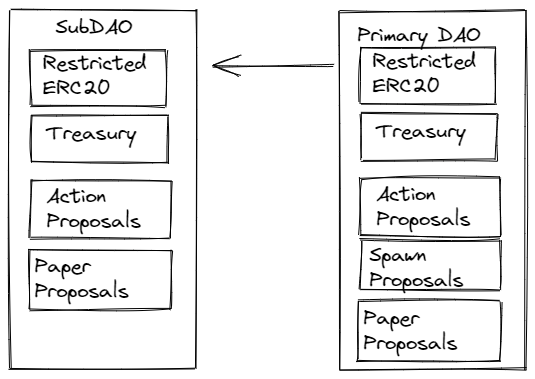

#  Frabric
Welcome to a revolution in DAO Governance. used by WeavrDAO to build Weavr (www.weavr.org)

This repository contains all the smart contracts which make up the Frabric Protocol, along with their tests and deployment scripts.
The Frabric Protocol is a set of infrastructure for use as part of a larger DAO deployment.

## Overview



As a DAO Federation builder, The Frabric Protocol's key functionality is the ability for the primary DAO to create a subDAO.
Each DAO also have the ability to:
- Have it's own Restricted ERC20 Token
- Define a whitelist to specify who can trade and hold said token
- Dedicated DEX for trading all tokens in the DAO Federation
- Dedicated proposal type for Token Actions (minting, burning, selling on dex, etc)
- Dedicated proposal type for minting new subDAOs (as the primary DAO)
- Dedicated proposal type for removing DAO members, and removing subDAOs from the DAO Federation
- Dedicated proposal type to upgrade the DAO federations smart contracts (and to adjust Channels)
SubDAOs are completely autonomous, and have the ability to accept upstream code changes, reject them; or create their own upgrades.

All contracts in the Frabric Protocol are upgradable, using the OpenZepplin-Upgrades library, and utilizes
[Beacon Proxies](https://docs.openzeppelin.com/contracts/3.x/api/proxy#BeaconProxy) to allow for upgrades to be performed atomically.

By default, all subDAOs use the same implementation of source code as defined by the Primary DAO; this is done via a beacon proxy mechanism.
However, subDAOs can also choose to fork their own implementation of the Frabric Protocol, and use that instead.

## Security

Audited by Quanstamp; report can be found [here](docs/audit_june2022.pdf)

## Setup

Assuming nodejs >= 16, npx, and yarn are available, run the following commands to install dependencies and compile the contracts:

```bash
yarn install
npx hardhat compile
```
if using tenderly, make sure to set the `TENDERLY` environment variable, and set a `~/.tenderly` file with your API key.

## Testing

```bash
npx hardhat test
```

### Coverage

```bash
npx hardhat coverage
```


## Deploying to Goerli 
The deployment of the Frabric Protocol is done in multiple stages, and requires a few environment variables to be set.
### Standard Environment Variables
used by all deployments, make sure to set these
- `PRIVATE_KEY` - The private key of the account which will be used to deploy the contracts
- `GOERLI` - the infura URL used to deploy to goerli
- `TENDERLY` - if defined, the deployment will be pushed to tenderly

### InitialFrabric
The Initial Frabric contract is a simple DAO which is used as a a starting point, accepting and "docking" with the larger Frabric Protocol. Creating a full DAO Federation.
#### Environment Variables
- `USD` - an ERC20 token already deployed to the network; this can be any ERC20 token contract (typically USDC), for Goerli that is: `0x2f3A40A3db8a7e3D09B0adfEfbCe4f6F81927557`
- `UNISWAP` - the uniswapRouterV2 contract address deployed to the network; for Goerli that is: `0x7a250d5630b4cf539739df2c5dacb4c659f2488d`
#### Deploy
```bash 
npx hardhat deploy --network goerli scripts/deployInitialFrabric.js
```

Take note of the resultant addresses; they will be used in the next step

### Frabric
The Frabric contracts, this deployment ships the interface and dependent core contracts of the Frabric Protocol; and sets the owner of these contracts to the Beacon Proxy (InitialFrabric) that was deployed in the previous step.
This doesn't immediately make these contracts available and alter behavior, that requires an UpgradeProposal to pass and be triggered before that can occur.

#### Environment Variables
- `FRABRIC` this is the `INITIAL FRABRIC` created in the previous step
- `AUCTION` the deployed `Auction` contract address created in the previous step
- `ERC20_BEACON` the deployed `ERC20 Beacon` created in the previous step
- `PAIR` the deployed `FRBC-USD pair` created in the previous step

#### Deploy
```bash
npx hardhat deploy --network goerli scripts/deployFrabric.js
```
After this has been deployed, take note of the FRABRIC address as that is the implementation needed in a ProposeUpgrade step.

### Upgrading from InitialFrabric -> Frabric
Now that the Frabric contracts have been deployed, and the InitialFrabric has been set as the owner of the Frabric contracts, we can now upgrade the InitialFrabric to the Frabric contracts.
#### Creating the Upgrade Proposal
This is done by creating a proposal in the InitialFrabric, and submitting it to the DAO. 
The proposal will be a `ProposeUpgrade` proposal, and will require a majority of the DAO to vote in favor of it.

##### Data Field
In order to make a proposeUpgrade call, you must generate the data component.
This contains all information around initial Governors, KYC, and the initial token supply.
```js
function generateData(bond_address, threadDeployer_address, kyc_address, governor_address) {
   return (new ethers.utils.AbiCoder()).encode(
        ["address", "address", "address", "address"],
        [bond_address, threadDeployer_address, kyc_address, governor_address]
    )
}
```

The result of this is a hex string that should be used as the data field in the proposal.


### Proposals

The order of function calls are the following:
- `ProposeUpgrade` - this is the first proposal, and is used to upgrade the InitialFrabric to the Frabric contracts
- `QueueProposal` - this queues the proposal made in the previous step, you will need to wait `QUEUE_PERIOD` days before moving on.
- `CompleteProposal` - this executes the proposal; the ProposeUpgrade must have passed it's votes, and you must wait for the `QUEUE_PERIOD` to end.
- `TriggerUpgrade` - this is triggered against the single Beacon that was provided with deployInitialFrabric.js.

#### ProposeUpgrade:
 - instance: 0x00
 - beacon: singleBeacon address for Initial Frabric
 - data: Data Field
 - code: address of Frabric (output of deploy Frabric) 
 - version: 2
 - info: 0x00

The output of this will be a proposal ID; a supermajority of InitialFrabric tokenholders will
need to vote on this proposal for it to pass.

#### QueueProposal:
 - id: proposal ID from ProposeUpgrade

#### CompleteProposal:
 - data: 0x00
 - id: (proposal id from ProposeUpgrade)

#### TriggerUpgrade:
- instance: BeaconProxy address for InitialFrabric (main address you've been interacting with)
- data: 0x00
- version: 2


If TriggerUpgrade succeeds, that means that you've successfully upgraded InitialFrabric -> Frabric.
